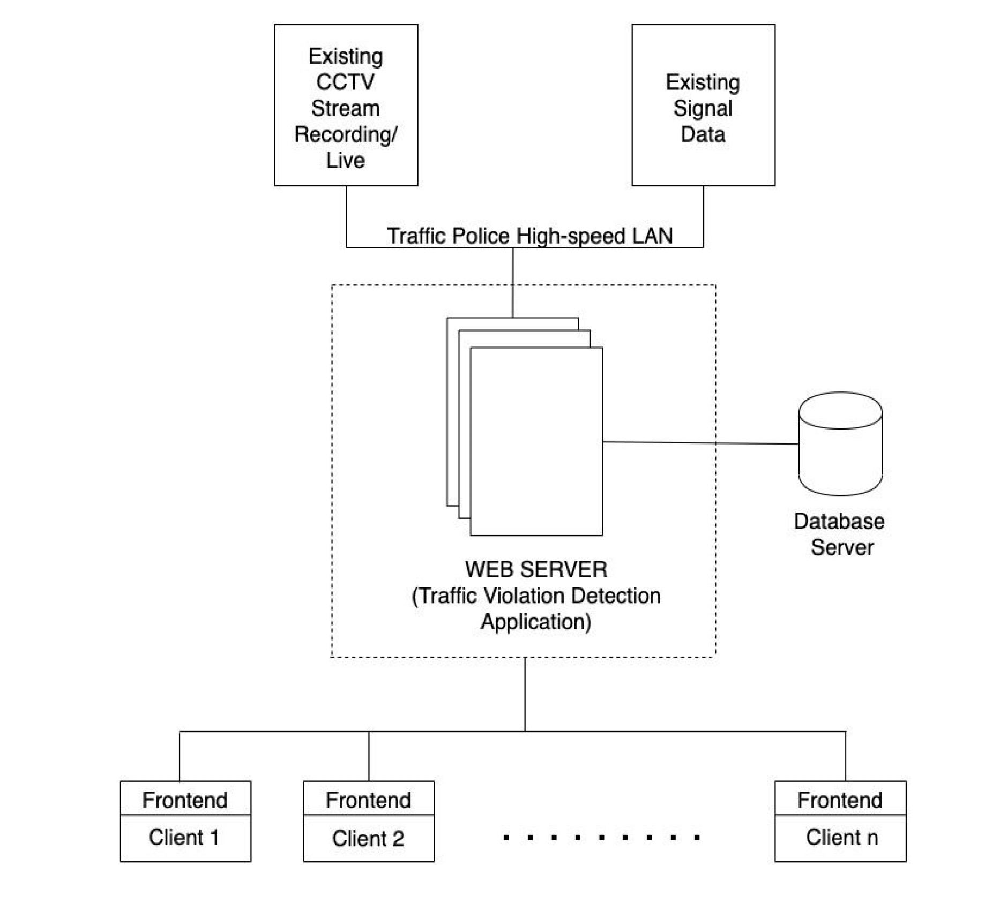
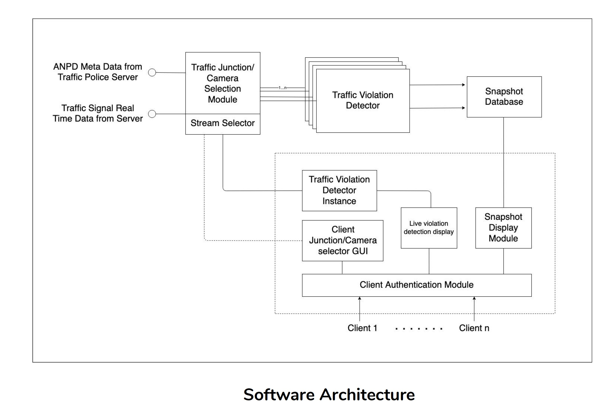
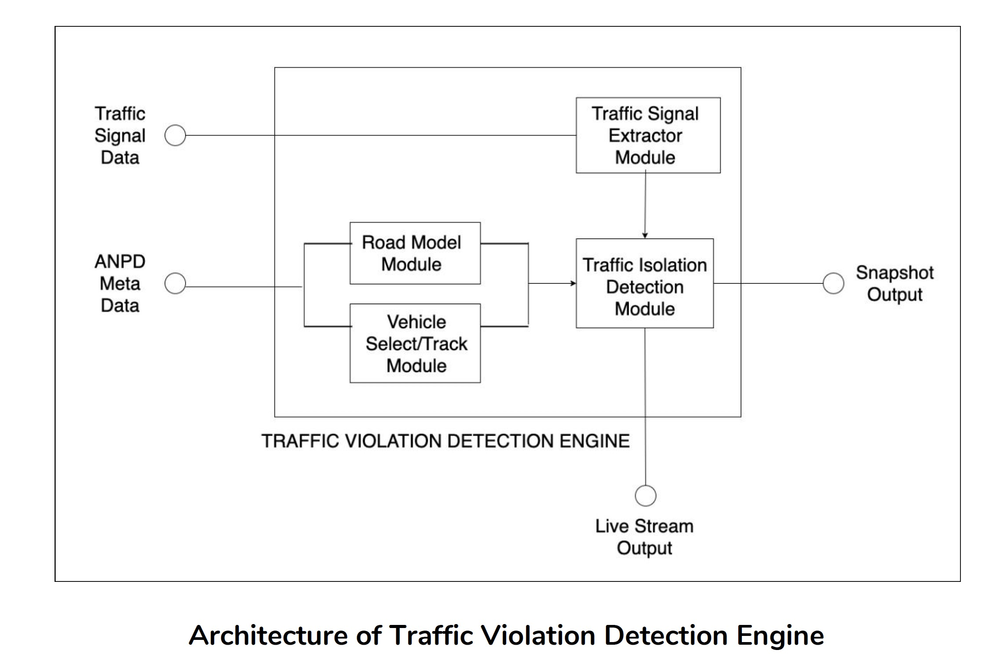
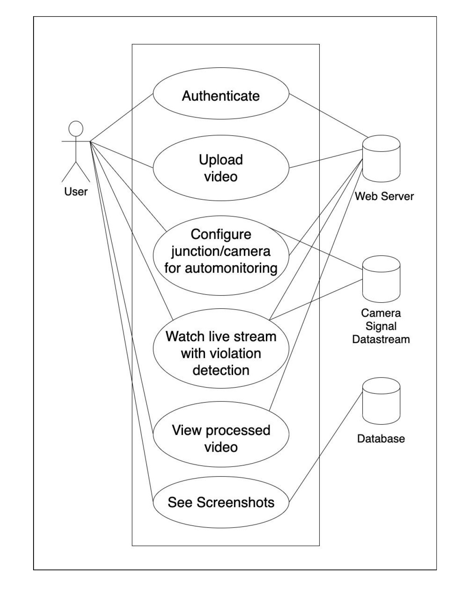

## Requirements

1. Automatically detect the traffic violations of rules being considered:

    * Compliance with traffic lights
    * Not stopping while pedestrians cross the road
    * Compliance with speed limit
    * Detection of a crash

2.  Violation detection should be done through the traffic data that is already available

    * From Video data streamed from cameras, or pre-recorded data fed by user
    * Real-time traffic signal data, that is available in an existing server.

3. Traffic violation detection should happen automatically for all selected junctions and snapshots are to be stored in a database server.
    * There should be a junction/camera selection which can be configured by the traffic police/ concerned authorities.

4. Traffic violation detection should be available for monitoring by the client.
    * They should be able to choose a particular junction/camera feed to monitor
    * Client should be able to feed in custom video data into the system
    * Live processed output should be available if the user demands for the same (GUI to be built for the same)
    * Traffic violations/car crashes should be alarmed on the monitoring displays in the control room.

## Assumptions

1. Availability of a camera stream/pre recorded data and live streams are connected to the police server. (NOTE: For this project, we will be implementing a Minimum Viable Product(MVP)  only the video upload and processing, since we don’t have enough hardware and time to learn and implement the product for a CCTV scenario)
2. In the case that the vehicle details should be detected, we assume that it is done by a separate system which performs automatic number plate detection, and extracts vehicle registration data from an already existing server (this is not in our project scope).
3. Traffic light data is available from all the junctions required as real-time values.

## Design Rationale

The design is based on a distributed architecture, since traffic violation detection is a resource demanding application; Not because of the algorithms involved, but due to the volume of data to be processed. The amount of data processed depends on the following factors:

* Traffic camera/junctions to be monitored simultaneously. 
* The amount of data processed depends on the day, time of the day etc., due to various traffic behaviors. 

Because of this, we need a system that automatically scales up as well as down as per the requirement. Also, the system should support live monitoring by a number of officers (clients), which may also increase due to certain events happening in the city. Considering all these the distributed architecture is selected.
When we go for distributed architecture, the next question is: “What is the basic architecture like?”. The nodes are not geographically distributed, and the network between the nodes are high speed LAN and are very reliable. Hence, the network partition is not considered. So, only node failure is considered. Hence we need a CA system.

## Architecture

### Overall High Level Architecture

### Software Architecture

### Traffic Violation Engine Architecture

### Use Case Diagram

### Microservices Architecture

1. Instead of having a monolithic architecture with layers stacked on one another, we are designing our application based on microservices architecture. Monolithic architecture only allows for vertical scaling, but with microservices architecture it's possible to achieve horizontal scaling easily.

2. Numerous benefits of Microservices architecture include :
    * Modularity : This makes the application easier to understand, develop, test, and become more resilient to architecture erosion.
    * Scalability  : Since microservices are implemented and deployed independently of each other, i.e. they run within independent processes, they can be monitored and scaled independently.
    * Distributed development: it parallelizes development by enabling small autonomous teams to develop, deploy and scale their respective services independently.

3. First option with microservices is to have a VM for each microservice. For eg, if our app has three microservices : frontend, backend and db then each microservice will run on a seperate VM. However, a virtual machine has a substantial overhead, like performance is poorer, it consumes a lot of memory in RAM & it occupies a lot of hard disk space. The idea solution would be a lightweight alternative to virtualization which brings us to docker.

Hence for our application, each microservice will be containerized with docker. Instead of having the entire operating system within a docker container, docker makes sure there's only enough kernel pieces to run the corresponding microservice.

4. Our web application will have seperate microservices for front end, database and each of the features of the backend. For example, for detecting overspeeding vehicles in a video, we will have a seperate microservice running which will take input as video and return output as snapshots of overspeeding cars.

5. While deploying the web application, it's necessary to have container orchestration. Container orchestration is all about managing the life cycles of containers, especially in large, dynamic environments. Software teams use container orchestration to control and automate many tasks including provisioning and deployment of containers, redundancy and availability of containers, Scaling up or removing containers to spread application load evenly across host infrastructure, Movement of containers from one host to another if there is a shortage of resources in a host, or if a host dies, Allocation of resources between containers, etc.

## Tools

* Front End:
We chose Angular as the front end framework.
Angular is considered a full MVC framework because it offers strong opinions as to how your application should be structured. It also has much more functionality “out-of-the-box”. You don’t need to decide which routing libraries to use or other such considerations. 

* Back End:
We chose Flask as the back end framework, since it provides simplicity, flexibility and fine-grained control. It is un-opinionated (it lets you decide how you want to implement things).

* Database:
PostgresSQL was chosen for of its scalability. 

* Object Detection:
YOLO : You only look once (YOLO) is a state-of-the-art, real-time object detection system.  

* Multiple Containers Management:
Docker-Compose is a tool for defining and running multi-container Docker applications. With Compose, we can use a single YAML file to configure application's services.
